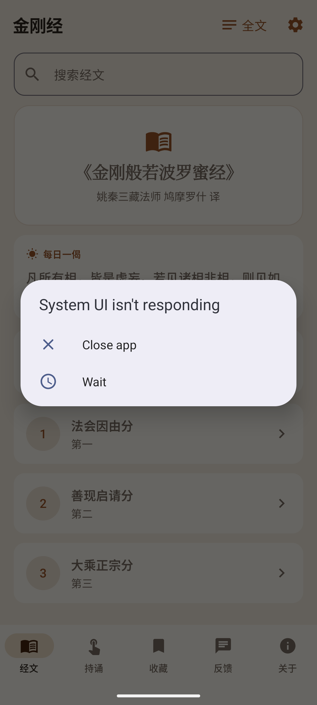

# 金刚经 · Diamond Sutra (Android)

A native Android reader for the **《金刚般若波罗蜜经》** (Diamond Sutra, Kumārajīva translation),
built with **Jetpack Compose** and **Material 3**. It presents the complete scripture across all
**32 chapters (分)** with chapter-by-chapter and full-text reading, Mandarin text-to-speech with
live highlighting, and an adjustable, comfortable reading experience — fully offline.

This is the Android twin of the
[iOS 金刚经 app](https://github.com/alfredang/jingangjinapp)
([App Store](https://apps.apple.com/app/diamond-sutra-%E9%87%91%E5%88%9A%E7%BB%8F/id6784362803)),
mirroring the same feature set in the Tertiary Infotech house style.



## Features

- 📖 **Complete scripture** — all 32 分, from「法会因由分第一」to「应化非真分第三十二」.
- 📜 **Two reading modes** — per-chapter reader, or a continuous full-text scroll of the whole sutra.
- 🔍 **Full-text search** — search across all 32 分, with matches highlighted and tap-to-jump to the chapter.
- 🔊 **Read-aloud (TTS)** — Mandarin recitation via Android's on-device `TextToSpeech`, with the
  currently-spoken passage highlighted live, play/pause/stop, and adjustable speed (慢 / 正常 / 快).
- 📿 **Recitation counter (持诵)** — an interactive tap counter with haptics, daily + lifetime
  totals, and a configurable daily target (21 / 49 / 108 / 1080).
- 🔖 **Bookmarks (收藏)** — save chapters for quick return; swipe to remove.
- 📊 **Reading progress** — per-chapter read tracking with a progress ring and "continue reading".
- ☀️ **Verse of the day (每日一偈)** — a daily famous line, with an optional daily **local-notification** reminder.
- 📤 **Share** — share any chapter's text via the system share sheet.
- 🔠 **Adjustable text size** — scale the body type up or down; the preference persists.
- 🌙 **Light & dark mode** — a warm "sutra paper" Material 3 theme (same tokens as the iOS app).
- 📡 **Fully offline** — all text is bundled in the app; no network, no account, no data collected.
- 💬 **Feedback via WhatsApp** and an **About** page (Tertiary Infotech house style).

## Screens

The app uses the house-style five-tab bottom navigation:

| 经文 (Read) | 持诵 (Recite) | 收藏 (Bookmarks) | 反馈 (Feedback) | 关于 (About) |
|---|---|---|---|---|
| Daily verse, progress ring, search, 32-chapter list, 全文 + 设置 in the top bar | Tap counter with daily / lifetime totals + target | Saved chapters, swipe to remove | Title + message → WhatsApp | App info, developer, content source, version |

设置 (Settings — font size, speech speed, daily reminder, progress reset) opens from the gear
icon on the Read tab.

## Tech stack

- **Kotlin** · **Jetpack Compose** (Material 3, `NavigationBar`, `Scaffold`, edge-to-edge)
- **android.speech.tts.TextToSpeech** — Mandarin read-aloud with `onRangeStart` live highlighting
- **AlarmManager + BroadcastReceiver** — daily 每日一偈 local notification (reboot-safe)
- **SharedPreferences** — persists bookmarks, progress, recitation counts and preferences
- minSdk **26** (Android 8.0), target/compile SDK **36**

## Project structure

```
app/src/main/java/com/tertiaryinfotech/jingangjing/
  MainActivity.kt            # entry point: theme + speech + reminder re-arm
  AppStore.kt                # persisted state: bookmarks, progress, counter, prefs
  model/Models.kt            # SutraChapter / SearchHit / Verse
  data/SutraData.kt          # full text of all 32 分 + search + verse-of-the-day
  speech/SpeechManager.kt    # TextToSpeech wrapper (play/pause/stop + highlight range)
  notify/Reminders.kt        # AlarmManager scheduler + notification + boot receiver
  ui/Theme.kt                # Material 3 theme (iOS color tokens ported)
  ui/RootScreen.kt           # bottom tabs: 经文 / 持诵 / 收藏 / 反馈 / 关于
  ui/HomeScreen.kt           # daily verse, progress ring, search, chapter list
  ui/ChapterDetailScreen.kt  # per-chapter reader (TTS + highlight + font + bookmark + share)
  ui/FullTextScreen.kt       # continuous full-sutra reading
  ui/ReciteScreen.kt         # 持诵 recitation counter
  ui/BookmarksScreen.kt      # 收藏 saved chapters
  ui/SettingsScreen.kt       # 设置 font / speed / daily reminder / progress reset
  ui/FeedbackScreen.kt       # WhatsApp feedback form
  ui/AboutScreen.kt          # app / developer / source / version
screenshots/                 # emulator screenshots
play-assets/                 # Play Store listing assets (icon, feature graphic, screenshots)
CHANGELOG.md                 # release notes (source of Play "What's new")
```

## Building

Requires JDK 17+ (Android Studio's bundled JBR works) and the Android SDK.

```bash
./gradlew assembleDebug          # debug APK
./gradlew bundleRelease          # signed AAB (needs keystore.properties, not checked in)
```

Release signing reads `keystore.properties` at the repo root:

```
RELEASE_STORE_FILE=jingangjing-upload-keystore.jks
RELEASE_STORE_PASSWORD=...
RELEASE_KEY_ALIAS=jingangjing
RELEASE_KEY_PASSWORD=...
```

The keystore and `keystore.properties` are **git-ignored** — keep them backed up privately.

## Acknowledgements

- Scripture: 《金刚般若波罗蜜经》, 姚秦三藏法师 鸠摩罗什 译 (public domain).
- Developed by **Tertiary Infotech Academy Pte Ltd** — [tertiaryinfotech.com](https://www.tertiaryinfotech.com)

---

> 一切有为法，如梦幻泡影，如露亦如电，应作如是观。
